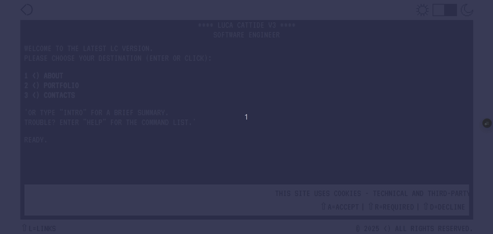
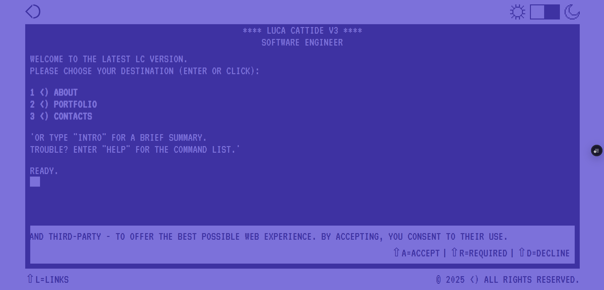
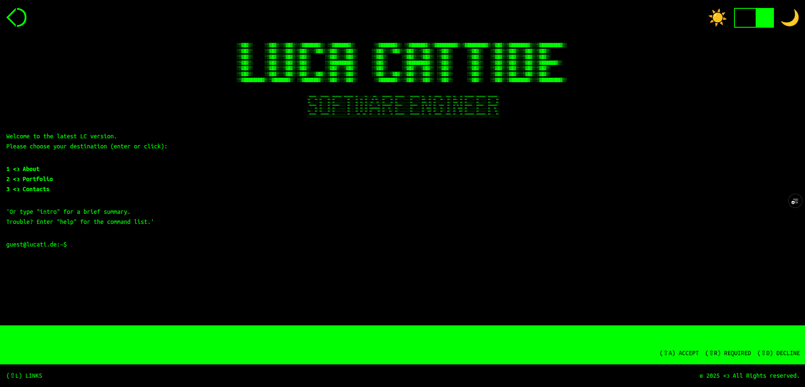

# LC 2.0

LC website version 2.0 (3).






[](https://github.com/lc-2025/lc-2.0/actions/workflows/ci.yml) [](https://github.com/lc-2025/lc-2.0/actions/workflows/cd.yml)

## About

A full-stack website based on _NextJS_ and _Sanity_ consisting of a professional portfolio for personal branding.

© LC 2025 <ↄ All Rights reserved.

## Features

- Commodore 64/Unix Bash experience AKA Light/Dark theme with system-detection support
- Fully-working terminal for website interaction, including:
  - Keyboard shortcuts
  - Command history
- Interactive portfolio navigation
- Cookie consent and management
- Responsiveness

## Bonus

- Easter-Egg

## Stack

### Languages

- HTML
- CSS
- SASS
- JavaScript
- TypeScript
- GROQ
- YAML
- Bash

### Environments

- DOM

### Libraries

- Headless UI
- GSAP
- TypedJS

### Frameworks

- React
- NextJS
- TailwindCSS
- Sanity
- Jest
- Cypress

### Pre/Post-Processors

- PostCSS
- Sass

### Linters/Plugins

- stylelint
- ESLint
- Prettier

### Compilers

- TypeScript

### Testing

- Jest
- Cypress

### Versioning

- GitHub
- Husky

### Continuous-integration/Delivery

- GitHub Actions

### Deployment

- Vercel
- Sanity

## Getting Started

The project production version is available on _Vercel_ at [https://lucati.dev](https://lucati.dev).
For any contribution, maintanance and/or trial needs, please refer to the following specifications and side-ones:

- [Frontend](./frontend/README.md)
- [Backend](./backend/README.md)

## Repository

The project reflects a monolithic setting - monorepo - using _NPM Workspaces_ to organize both frontend than backend sides.
Workspaces may be globally managed accordingly to the following specifications.

## Setting Up

On terminal, from project root:

- To install dependencies for all the workspaces:

```bash
npm run setup
```

- To lint the sources for the `Frontend` workspace:

```bash
npm run lint
```

- To build the production version of all the workspaces:

```bash
npm run build
```

- To run the tests in `testing` mode (staging or content-integration/delivery environments) on the `Frontend` workspace:

```bash
npm run test
```

- To deploy the production version of the `Backend` workspace:

```bash
npm run deploy
```

## Contributing

Please read more about required best practices on the specific [contributing reference document](./.github/CONTRIBUTING.md)
